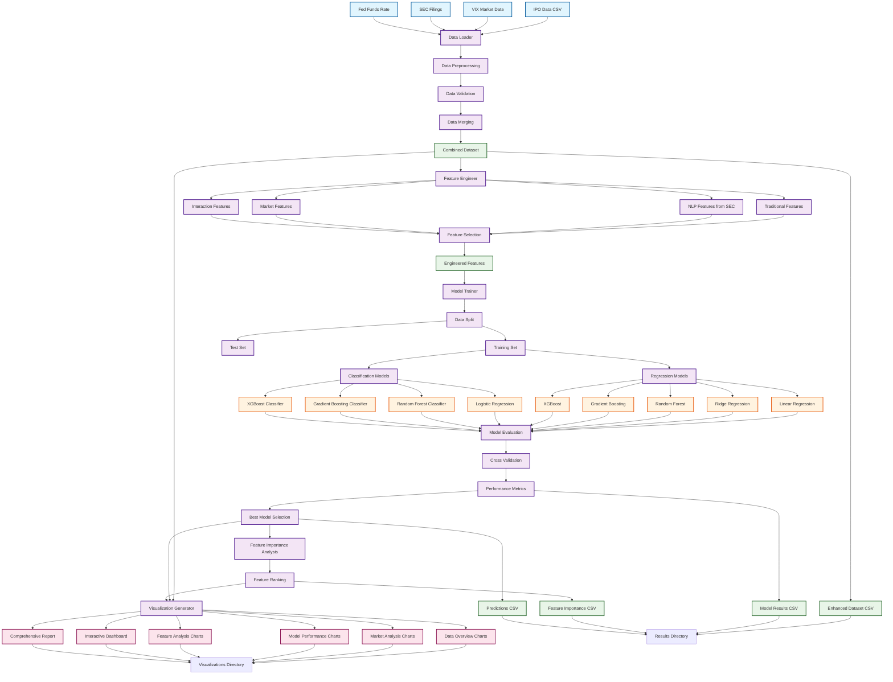
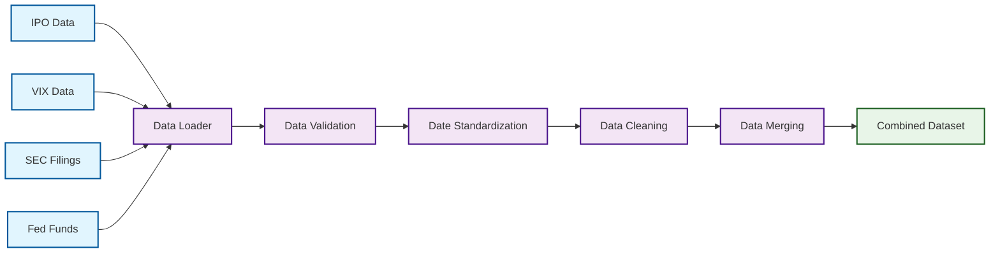
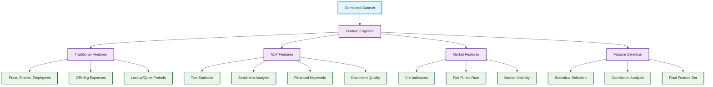
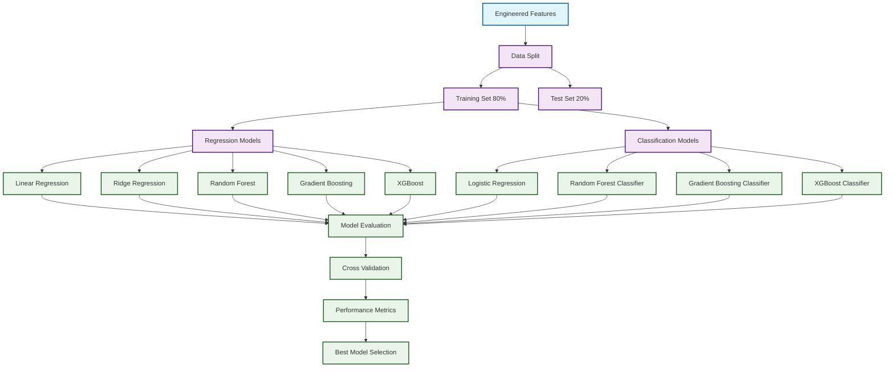
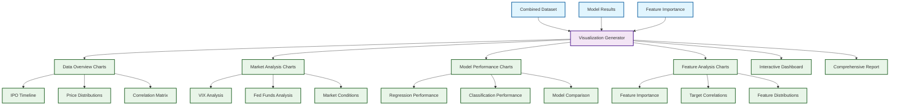
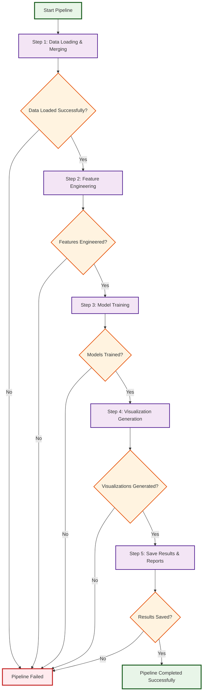
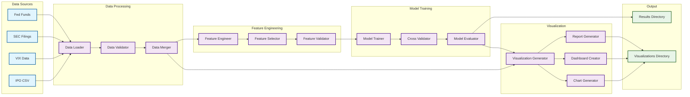

# IPO Analysis ML Pipeline - Flow Diagram

## Complete Pipeline Flow

## Detailed Component Flow

### Data Loading Phase

### Feature Engineering Phase

### Model Training Phase

### Visualization Generation Phase

## Pipeline Execution Flow

### Main Pipeline Steps

### Data Flow Architecture

## Key Pipeline Characteristics

### **Modular Design**
- Each component has a single responsibility
- Components can be tested independently
- Easy to add new features or models

### **Data Flow**
- Unidirectional data flow from sources to outputs
- Clear separation between data, features, models, and visualizations
- Robust error handling at each step

### **Scalability**
- Can process limited or unlimited SEC filings
- Configurable feature selection and PCA
- Modular model architecture

### **Output Generation**
- Comprehensive CSV results
- High-quality PNG visualizations
- Interactive HTML dashboards
- Detailed markdown reports

### **Error Handling**
- Graceful failure at any step
- Detailed logging throughout
- Pipeline stops on critical errors
- Partial results saved when possible

---

*This flow diagram shows the complete architecture and data flow of the IPO Analysis ML Pipeline, from raw data ingestion to comprehensive visualization and reporting.*
